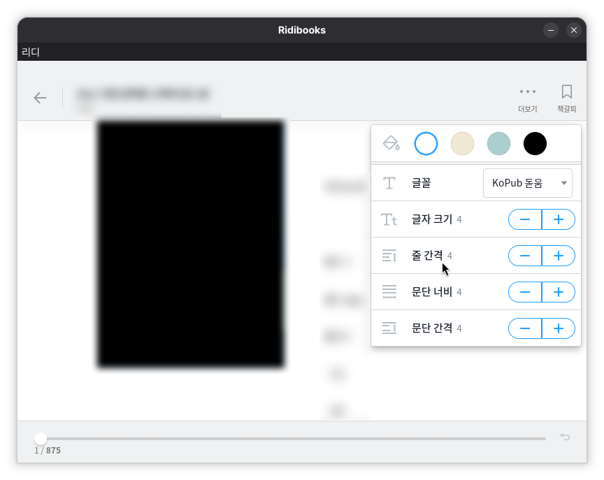

# Ridibooks-linux-buildscript

**이 저장소와 하위 스크립트는 RIDI Corp 와 무관함을 알립니다. 모든 바이너리는 prepare.sh 스크립트를 통해 빌드 시 다운로드되며, 이 저장소는 그 자체로 RIDI Corp 의 저작물을 포함하지 않습니다. 저장소의 라이선스는 오직 빌드 스크립트에만 적용되며 최종 산출물이나 빌드중 다운로드 받은 파일에 적용되지 않습니다. ridibooks 는 RIDI Crop 의 상표이며 이 프로젝트는 RIDI Crop 과 어떠한 종류의 제휴, 보증, 후원 관계에 있지 않으며 무관합니다. 이 저장소의 내용은 있는 그대로 제공되며 저장소의 소유자 당사는 어떠한 종류의 책임 또는 보증을 제공하지 않습니다. 빌드 산출물의 경우 사용자가 책임지고 사용해야하며, 이 경우 RIDI Crop 의 이용약관을 준수하여야합니다.**



이 스크립트는 windows 용 ridibooks 데스크탑 어플리케이션을 cdn으로부터 다운로드하여 리눅스 어플리케이션으로 재패키징하여 설치할 수 있는 형태를 만듭니다.

이 스크립트는 어플리케이션의 내부적 로직을 전혀 바꾸지 않습니다. 단순히 `setup.exe` 로 부터 `app.asar` 을 찾아 추출한 뒤 리눅스에서 실행 가능하도록 패키징만 수행합니다

대상 배포판은 arch-linux 이나, ridibooks 는 electron 을 기반으로 작성되었기 때문에 다른 배포판에서도 `./prepare.sh` 와 `./build.sh` 를 순차적으로 실행하면 `release/*/Ridibooks` 에 실행 가능한 electron 빌드가 놓이게 됩니다.

빌드타임 디펜던시는 `sed 7zip curl grep nodejs npm graphicsmagick` 이며, 런타임 디펜던시는 없습니다.

## arch-linux 에서 yay 로 빌드하고 설치하기

```
git clone https://github.com/qwreey/ridibooks-linux-buildscript
cd ridibooks-linux-buildscript
yay -Bi . --keepsrc
```

yay 가 시스템에 설치된 경우 `yay -Bi` 명령을 통해 빌드하세요.

